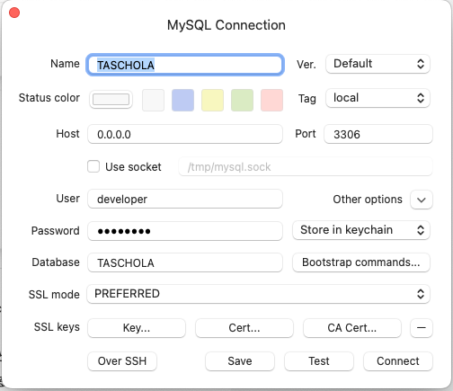

# TASCHOLA

TASCHOLA is a simple todo list manager which can sync with Tokyo Tech T2SCHOLA.

## Set Up

Docker 環境が用意されているのは、MySQL(DB)と Go Gin(Backend)のみである。

フロントエンドについては、ローカルで開発するために、yarn を使用している。

アプリケーション全体を試す場合は、Terminal のタブを 2 つ用意し、片方で Backend の起動、もう片方で Frontend の起動を行う。
localhost は共有されているので、フロントエンドとバックエンドは CORS を通じて通信することができる。

### For Backend

1. Move to the directory `cd TASCHOLA`
2. `docker compose up -d`

ログを見たい場合は、`docker compose up`を使用する。
(`docker compose down`をするために Terminal のタブがもう一つ必要)

注意: DB(MySQL) -> API(Go Gin) の順に起動するようになっている。そのため、起動までに時間がかかることが予想される。特に、MySQL は初回起動時に時間がかかる。(それぞれの PC のスペックにもよるが初回起動時は 5〜8 分程度要する場合もありうる。)

注意: もし起動に失敗した場合は、`docker compose down`の後、`docker compose up`としてみよう。エラーメッセージが表示されているはずである。

### For Frontend

1. install yarn

   - For Mac

     ```bash
     brew install yarn
     ```

   - For Windows

     ```bash
     npm install --global yarn
     ```

     brew でも問題ありません

2. Move to the directory `cd frontend`
3. `yarn install`
4. `yarn dev`

## For Developers

### Frontend

- import path alias

  相対パスでの import は、ファイル構造を把握するのが難しくなるため、絶対パスでの import を行う。

  import パスのルートは `frontend/`である。

  参考: https://qiita.com/tatane616/items/e3ee99a181662ad6824b

- tailwind css

  CSS フレームワークとして、tailwind css を使用している。

  参考: https://tailwindcss.com/docs/guides/nextjs
  参考: [Next.js に Tailwind CSS を導入する](https://fwywd.com/tech/next-tailwind)

  Tailwind CSS を読み込んでいるのは、`frontend/styles/globals.css`である。

  ```scss
  @tailwind base;
  @tailwind components;
  @tailwind utilities;
  ```

  また、この`globals.css`は、`frontend/pages/_app.ts`で読み込んでいる。

### Backend

- CORS について

  CORS 自体についての説明は以下

  https://developer.mozilla.org/ja/docs/Web/HTTP/CORS

  `backend/router/router.go`にて実装してある。
  詳細な設定方法は、ドキュメント参照のこと

  https://pkg.go.dev/github.com/gin-contrib/cors?utm_source=godoc#Config

  注意点として、CORS の設定は routing の前に行う必要がある。

  そのため、

  ```go
  // health check
  engine.GET("/health", controllers.HealthCheck)
  ```

  の前に、CORS の設定を書く必要がある。

- TablePlus について

  DB の状態を確認する目的や、ダミーデータを作成する目的で TablePlus を使用している。

  接続方法は、`Create a new connection` の後以下のように入力すればよい。
  Password は、docker-compose.yml に記載されているものを使用する。
  (`MYSQL_ROOT_PASSWORD`のところを参照)

  

- MySQL との接続について

  `wait-for-it.sh`を用いて、MySQL が起動するまで待機するようにしていたが、`healthcheck:`を利用することにより、`docker-compose.yml`だけで依存関係と実行順番制御が行える。

  - heath check について (死活監視)

    Go Gin においては、`/health`エンドポイントを作成し、問題なく Gin が起動している場合は`200`を返すようにしている。

    また、MySQL については mysqladmin ping で問題なく接続できるかいなかを確認している。

  - health check の詳細

    `docker-compose.yml`の `healthcheck:`, `test:` に実際に確かめるために使用しているコマンドが記載されている。

    また、health check の周期なども`docker-compose.yml`で設定している。

- Swagger

  API のドキュメントを作成するために、Swagger を使用している。

  ただし、YAML で記述するのが面倒なので、Swagger 自動生成ツールである [swag](https://github.com/swaggo/swag) を使用している。

  Go のコード中にある`// @Summary`などのコメントを元に、`swagger.yaml`を生成している。
  (そのため、main.go や controllers/\*.go 中のコメントをむやみに変更してはいけない)

  `docker compose up`後に http://localhost:8000/swagger/index.html にアクセスすると、Swagger の UI が表示される。

  

  上記の Swagger から、API リクエストを送信することができる。

  そのため、API の動作確認を行う際には、Swagger を利用するとよい。

### DB

- Set Up

1. `docker compose up -d`
2. install sql-migrate (下記の 1. Installation を参照)
3. `sql-migrate status`で、現在の DB の状態を確認する
4. `sql-migrate up`で、migration を実行する

`sql-migrate status`の具体例


- Migration

DB の中身を変更することがあると思うので、Migration を楽にするツールを導入した。

sql-migrate: https://github.com/rubenv/sql-migrate

1. Installation

   ```bash
   go install github.com/rubenv/sql-migrate/...@latest
   ```

2. Check Status

   ```bash
   sql-migrate status
   ```

3. Create Migration File

   ```bash
   sql-migrate new <migration_name>
   ```

4. Apply Migration

   ```bash
   sql-migrate up
   ```

5. Rollback Migration

   ```bash
   sql-migrate down
   ```

- 暗号化

SHA256: https://pkg.go.dev/crypto/sha256
出力結果は、size = 32 bytes (= []byte)である

そのため、users table の password は、size = 32 bytes のものを入れる必要がある

### 参考資料

#### Frontend

- [Next.js 公式ドキュメント](https://nextjs.org/docs/getting-started)
- [Next.js 非公式日本語ドキュメント](https://nextjs-ja-translation-docs.vercel.app/docs/getting-started)

- [axios 公式ドキュメント](https://axios-http.com/docs/api_intro)
- [axios に型をつける](https://zenn.dev/mkt_engr/articles/axios-req-res-typescript)

- [Safe Data Fetching in Modern JavaScript](https://www.builder.io/blog/safe-data-fetching)

#### Backend

- [Go Gin CORS + 認証](https://qiita.com/bty__/items/f8c4393bd7701a1d703c)
- [docker-compose におけるヘルスチェック](https://qiita.com/hichika/items/9b96634d471246359e66)
- [Go Gin における CORS の設定](https://ti-tomo-knowledge.hatenablog.com/entry/2020/06/15/213401)
- [Github: swag](https://github.com/swaggo/swag)
- [Swaggo Swag: Go の Swagger 生成ツール](https://qiita.com/pei0804/items/3a0b481d1e47e5a72078a)
- [Go + Gin Swagger 自動生成ツール](https://qiita.com/takehanKosuke/items/bbeb7581330910e72bb2)
- [Go の FoDoc から Swagger を書き出そう](https://tikasan.hatenablog.com/entry/2018/03/28/175337)
- [JWT 入門](https://qiita.com/knaot0/items/8427918564400968bd2b)

#### DB

- [Go 製マイグレーションツール sql-migrate](https://qiita.com/k-kurikuri/items/946e2bf8c79176ef3ff0)
- [Go の migration ツールのデファクトってなくないですか？](https://onemuri.space/note/is3ev1-d1/)
- [sql-migrate の使い方](https://k2ss.info/archives/3342/)

### その他

- Docker Compose UP 後に発生する `db       | 2023-01-17T15:11:15.808061Z 1106 [Note] Access denied for user 'mysql'@'localhost' (using password: YES)` エラーについて

  結論: そもそも問題はなかった。go-gin -> mysql への接続は成功していた。

  教訓: DB Access Check 用のエンドポイントを作成して、そこから接続確認を行う方法にもっと早く気づけばよかった。

  以下、調査の経緯

  1. db/data のせいかと思い削除したりしてみたが、変わらずエラーが発生した
  2. [volume 関連の修正方法 1](https://qiita.com/akifumii/items/06e79428b09613235aa8), [volume 関連の修正方法 2](https://zenn.dev/tojima/articles/32bbfe85dd0022)を試すも、変わらずエラーが発生した
  3. Gin -> MySQL への接続が失敗しているのかと思い、docker-compose.yml の environment 周りや、backend/db/conn.go などを見直したが、おかしな点は発見できず。 -> そもそもエンドポイントのエラーメッセージが出力機構が貧弱すぎた。もっとちゃんと出力させていたら、ここではないことに気づけたかもしれない。


### nodenv

[Github: nodenv](https://github.com/nodenv/nodenv)

next-auth をいれる債に local の node のバージョンが問題で、うまくいかなかったので、nodenv を入れることにした。

Error Message:

```bash
❯ yarn add next-auth
yarn add v1.22.19
[1/4] 🔍  Resolving packages...
[2/4] 🚚  Fetching packages...
error next-auth@4.18.8: The engine "node" is incompatible with this module. Expected version "^12.19.0 || ^14.15.0 || ^16.13.0 || ^18.12.0". Got "18.4.0"
error Found incompatible module.
info Visit https://yarnpkg.com/en/docs/cli/add for documentation about this command.
```

nodenv のインストール, 設定

```bash
❯ nodenv install 18.12.0
Downloading node-v18.12.0-darwin-arm64.tar.gz...
-> https://nodejs.org/dist/v18.12.0/node-v18.12.0-darwin-arm64.tar.gz
Installing node-v18.12.0-darwin-arm64...
Installed node-v18.12.0-darwin-arm64 to /Users/kazuki/.nodenv/versions/18.12.0

❯ nodenv global 18.12.0
```

What is nodenv? (Ref: [nodenv/nodenv:](https://github.com/nodenv/nodenv#how-it-works))

> How It Works
> At a high level, nodenv intercepts Node commands using shim executables injected into your PATH, determines which Node version has been specified by your application, and passes your commands along to the correct Node installation.

> Understanding PATH
> When you run a command like node or npm, your operating system searches through a list of directories to find an executable file with that name. This list of directories lives in an environment variable called PATH, with each directory in the list separated by a colon:

> /usr/local/bin:/usr/bin:/bin
> Directories in PATH are searched from left to right, so a matching executable in a directory at the beginning of the list takes precedence over another one at the end. In this example, the /usr/local/bin directory will be searched first, then /usr/bin, then /bin.

### Next Auth

[Next Auth](https://next-auth.js.org/getting-started/upgrade-v4)

[Next Auth: jwt-helper](https://next-auth.js.org/configuration/options#jwt-helper)
